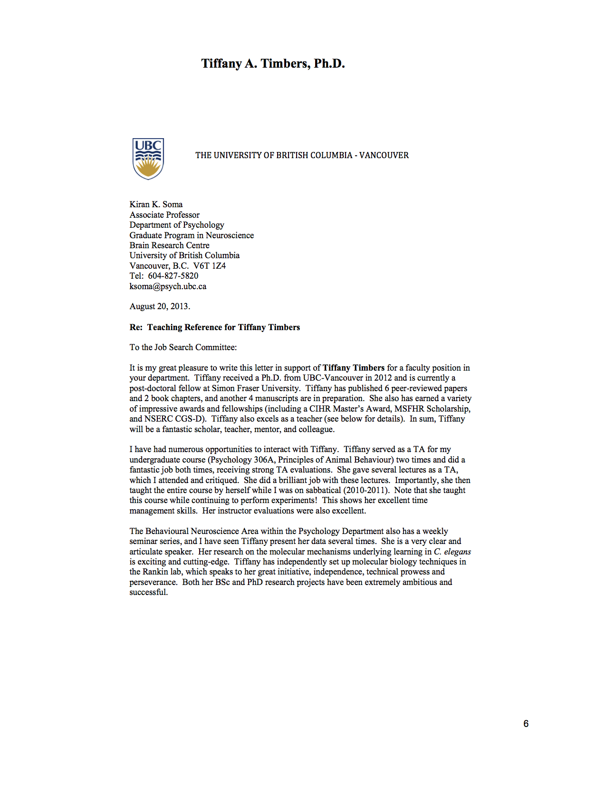

##Tiffany A. Timbers, Ph.D.
Simon Fraser University, 8888 University Drive,Burnaby, BC, Canada V5A 1S6  

tel. 604-803-4962  
email. [tiffany.timbers@gmail.com](mailto:tiffany.timbers@gmail.com) 
website: [tiffanytimbers.com](tiffanytimbers.com) 
Github: [github.com/ttimbers](github.com/ttimbers)

 

##Evidence of Teaching Effectiveness Statement

### Contents:

**a.** Previous Graduate and Undergraduate Students Testimonials  
**b.** Letter of Teaching Effectiveness 
**c.** Instructor Teaching Evaluations

### a. Previous Graduate and Undergraduate Students Testimonials

Testimonials from previous undergraduate students for whom I served as a Teaching Assistant for an undergraduate course and/or supervised their undergraduate research project directly. I have also attached two testimonials from current graduate students of whom I was senior to during my PhD studies; Evan Ardiel and Tahereh Bozorgmehr are currently doctoral students in Neuroscience at the University of British Columbia.

**(i) Undergraduate Student Testimonials  **

*To Whom it May Concern,
I have been working under Tiffany’s guidance in the Rankin lab for four summers and am currently co-authoring a paper with her. I had no prior lab experience when I began, and despite the complexities of our various projects throughout the years, Tiffany has always catered to my level of understanding when explaining both the theoretical and practical aspects of procedures. She has been encouraging and patient with me even when I encountered challenges or made mistakes.* 

*She is considerate of my busy schedule and offers to help when I am away. Before assigning a new task she checks to make sure that the workload does not exceed what I can handle. She informs me well in advance of the direction of our projects, and includes me in the process by enquiring about my thoughts on the plan before proceeding.*

*By encouraging me to attend research talks and providing me with relevant or interesting articles, Tiffany ensures that I am constantly developing and expanding my knowledge of neuroscience rather than merely polishing lab skills. As a result of this comprehensive exposure to research, I realize what a career in academia involves and am greatly motivated to do well.*

*On many occasions she has specially stayed overtime to train me or to supervise my first attempt at a procedure. Even when the instructions for a miniprep were already detailed in a booklet, she came to work early to walk me through the steps. I am able to carry out a broader range of techniques than the majority of undergraduates in the lab because she was willing to spend the time and effort to train me. In addition to her natural competency at teaching, Tiffany dedicates herself fully to student learning. In my experience as a research assistant in two neuroscience labs, and as a UBC student for five years, I know that the possession of both these qualities is hard to come by.*

*Sincerley,  
Kirsten Lee*

*From the moment I met Tiffany, I knew that she would be an exceptional mentor who invests in the needs of her students first. Prior to obtaining a volunteer lab position with Tiffany, I had never worked with C. elegans before. However, my uncertainties were quickly eliminated because of the confidence and trust instilled by her. By providing me with the necessary materials she equipped me with a means to build a base of which to further my knowledge. With that, I was comfortable to work independently in the lab shortly after starting. Tiffany shows dedication to the development of her students by remaining involved with them and their project. As a reflection of her sustained interest we conduct regular check-ins over e-mail and in person. Not only does she check-in on project work, she cares for her students by ensuring that they are enjoying the work they are doing. Her notable level of interest is only contagious in that it further motivates me to produce high quality results as well as inspires me to pursue a career in research. Furthermore, by thinking from her student’s perspective, she provides valuable input that is fundamental to the growth and progression of both the project and of her student’s career development. Her willingness to be creative and open-minded in problem solving allows her students to advance in their own thinking.  By bringing herself down to a student’s level I would feel comfortable approaching Tiffany with novel ideas pertaining to my project. I appreciate that Tiffany encourages her student’s to ask questions at any time as I often have questions as my project progresses. After walking away from a conversation with Tiffany I always have a clearer sense of which direction my project is taking and how it fits into the overall bigger picture. Additionally, her friendly and charismatic demeanor makes her a very approachable person and a joy to be around. I feel fortunate to have a mentor as supportive and encouraging as Tiffany.*  

*Sincerely,  
Wendy Lee*

*To Whom It May Concern:
	During her position as a doctoral candidate, Tiffany was my mentor from 2007-2009. During the mentorship, I assisted with a portion of her doctoral project in the Rankin Lab to aid her in the investigation of habituation in C. elegans. Tiffany demonstrated a high level of attentiveness, helpfulness, and professionalism. She has helped me improved on multiple skills, including literature reviews, research analysis, and critical thinking. Moreover, her thoughts and ideas are well organized; she is very effective in delivering instructions, and delegating work. Lastly, on a personal level, Tiffany was very considerate. I was able to speak with her about personal issues and future goals, and she gave me excellent advice.  As such, I believe that she would be an asset to any employer, and I recommend her for any endeavor she chooses to pursue.*

*Yours truly,  
Mavis Chan*

*To Whom it May Concern,
I was a student in Dr. Timbers’ Animal Behaviour course in spring 2011, which was a truly enriching learning experience. Although the class had around 100 students, Dr. Timbers created an environment that promoted participation; we were often prompted with questions and were encouraged to ask for clarification. Rather than the usual memorization and regurgitation of facts, we were expected to think critically about the experiments of animal behaviour that we studied. The exams and assignments had an experimental focus; we were asked to critique experiments, and to design original experiments that test for certain hypotheses about animal behaviour. Dr. Timbers’ knowledge and passion for the topic was clear and inspirational.*   

*I had the pleasure of knowing Dr. Timbers more closely while I completed my undergraduate Honours project in Dr. Catharine Rankin’s laboratory, where Dr. Timbers was a senior graduate student. She offered me help with various experimental protocols and analysis. Dr. Timbers was friendly and consistently approachable; she played an integral role in making the lab collegial place that it was.*  

*Sincerely, 
Rand Mahoumad*

**(ii) Graduate Student Testimonials**

*To Whom it May Concern,
	I met Tiffany Timbers in September 2006 when I started working as a graduate student for Dr. Catharine Rankin. Tiffany had only been in the lab for 1 year at this point and was not yet the most senior student, but her natural aptitude for teaching accelerated her into a mentorship position in which she really excelled. She invested a lot of energy introducing me to the lab and techniques, but more importantly into the world of science. Over the next five years I continued to learn from Tiffany, as she became an incredibly talented researcher. Most notably, Tiffany led the molecular biology revolution in our lab, which transformed the research from behavioural characterization to genetic manipulation. Tiffany organized a series of talks about primer design, PCR reactions, cloning, etc. Everyone in the lab, including Dr. Rankin, benefited greatly from these presentations, as well as countless informal discussions with Tiffany. She is the perfect academic – a passionate and skilled scientist, but also a natural teacher.*
	
*Evan Ardiel, M.Sc., Ph.D. Candidate 
Rankin Lab, Brain Research Centre 
University of British Columbia*

*To whom it may concern,
	I have known Tiffany Timbers since fall 2010 when I started to work in Dr. Rankin’s lab as a volunteer. At that time Tiffany was a senior graduate student in the lab and I assisted her by scoring videotaped behaviour for her. During the time she trained me to score videotaped behaviour I explained to her that since I came to Canada a couple of years ago I had a hard time finding a PhD position because of my lack of molecular biology knowledge. She generously started to train me in molecular techniques and encouraged me to improve my skills. In a short amount of time I spent as a volunteer in their lab under her supervision I was able to finish a genetic cross and she perfectly trained me to do PCR fusion to create cell-specific RNAi constructs to knockdown a gene of interest. Six months later I was able to start my PhD in Dr. Rankin’s lab and I definitely can say if Tiffany did not support me I would not be in this position right now. She left Rankin lab in 2012, but even now if I have any questions or need any help she is always generously helps me. I can trust on her knowledge and experiences more than all other people that know around me.* 
	
*Tahereh Bozorgmehr, M.Sc. Biology 
Cell and Developmental Graduate Program  
Brain Research Centre*

### b. Letter of Teaching Effectiveness

### c. Instructor Teaching Evaluations

